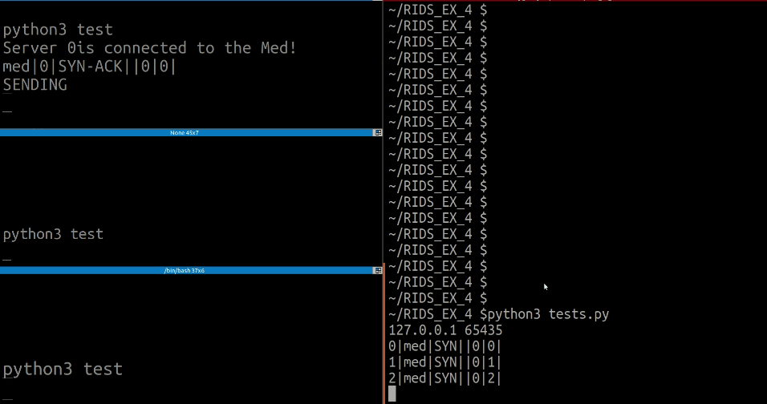

#                Asynchronous agreement

the following protocol solves an asynchronous agreement with N = 2f + 1 
servers and an adaptive adversary that can cause f omission failures.

The following project is the final project of Reliability in Distibuted Systems

The Agreement Simulation Abstraction:

# Server Class
- A server cummunicates with another server using the mediator
- Each of the servers runs N different worlds and comminicates in them seperately.
- Each of the servers in each world is sending his value in order to promote it
- A server decides iff it has  N-F-1 servers are agree on the same value
# Mediator Class
- delays messages to a random period of time (using system interrupts)
- mediates between the servers - i.e all messages are going through the mediator in their path to the other servers

